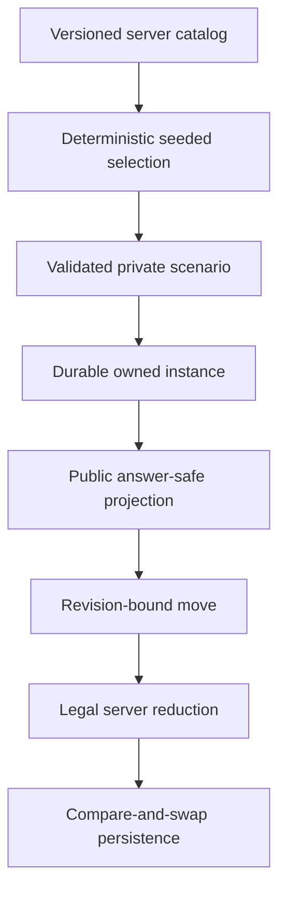

# Deep minigame data flow

The existing authenticated standalone-minigame route remains the only runner.
Deep games do not introduce a second client-side catalog or persistence path.

## Creation

1. The server authenticates the bearer and confirms the deep-game feature flag.
2. It creates an unpredictable instance ID and uses that ID as the deterministic
   selection seed.
3. It selects one active catalog record for the requested family.
4. It validates the private scenario, creates revision `0`, and persists the
   full private scenario/state under the authenticated user ID.
5. It returns only the public projection.

## Mutation

Every advance, reveal, retry, and reset request includes the last public
revision. The server:

1. authenticates and loads an owned, unexpired instance;
2. rejects missing or stale revisions;
3. validates/reduces the action against the private scenario;
4. updates only where the stored revision still equals the expected revision;
5. increments the revision and returns the new public projection.

This prevents simultaneous clicks, stale tabs, and replayed requests from
committing multiple transitions.

## Answer boundary

The catalog, scenario solution, accepted line, engine evidence, and provider
metadata never appear in create/get/advance projections. An explicit reveal may
return the learner route as feedback; it still does not return credentials or
unnecessary engine evidence.
